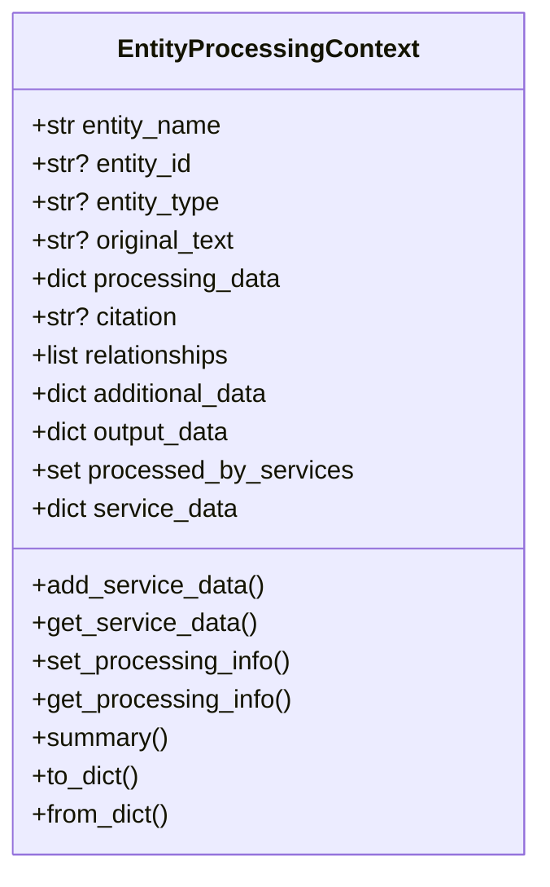

# EntityProcessingContext – Architektur & Best Practices

*Stand: 2025-06-15*

`EntityProcessingContext` ist das Herzstück von *entityextractorbatch*. Jeder Service – Wikipedia, Wikidata, DBpedia, usw. – liest aus und schreibt in genau **einen** Instanz dieses Kontexts pro Entität. Dieses Dokument erklärt Aufbau, Lebenszyklus und empfohlene Nutzung, damit Dritte problemlos eigene Services oder Tools integrieren können.

---
## 1. Motivation

Die Extraktions-Pipeline besteht aus lose gekoppelten Services, die schrittweise neue Informationen zu einer Entität anreichern. Ein gemeinsamer Datencontainer verhindert fragile Zwischen-Formate und erleichtert **Caching**, **Serien-Verarbeitung** und **Statistikerhebung**.

---
## 2. Klassendiagramm (vereinfacht)



---
## 3. Zentrale Felder

| Attribut | Typ | Zweck |
|----------|-----|-------|
| `entity_name` | str | Primärer Name der Entität (z. B. "Albert Einstein"). |
| `entity_id` | str / None | Optional vom Aufrufer vergebene ID. |
| `entity_type` | str / None | Kategorie wie `PERSON`, `LOCATION` – nicht zwingend. |
| `processing_data` | dict | **Interner Austausch** temporärer Infos zwischen Services (z. B. Wikipedia-Sprach-Labels). Wird serialisiert. |
| `output_data` | dict | Finale, API-kompatible Ausgabe. Wichtige Struktur:
  ```jsonc
  {
    "entity": "Albert Einstein",
    "details": {"typ": "PERSON", "inferred": "explicit"},
    "sources": {
      "wikipedia": {...},
      "wikidata": {...}
    }
  }
  ``` |
| `service_data` | dict | Roh-Service-Antworten (gleich wie `processing_data`, aber nur persistente Ergebnisse). |
| `processed_by_services` | set[str] | Tracking, welche Services bereits erfolgreich liefen. |
| `relationships` | list[dict] | Triples zwischen Entitäten (Knowledge-Graph). |
| `citation` | str | Textpassage, in der Entität gefunden wurde. |
| `additional_data` | dict | Platz für Metadaten abseits definierter Felder. |

---
## 4. Lebenszyklus einer Entität

1. **Instanziierung**
   ```python
   ctx = EntityProcessingContext(entity_name="Albert Einstein", entity_type="PERSON")
   ```
2. **Verarbeitung durch Services**
   ```python
   wikipedia_service.process_entity(ctx)
   wikidata_service.process_entity(ctx)
   dbpedia_service.process_entity(ctx)
   ```
   Jeder Service ruft `add_service_data('wikipedia', data)` etc. auf, was automatisch:
   * Informationen unter `sources.<service>` ablegt.
   * `processed_by_services` aktualisiert.
   * Basics in `details` synchronisiert (via `_update_details_from_service`).
3. **Kommunikation zwischen Services**
   * `set_processing_info('wikipedia_multilang', {...})`
   * `get_processing_info('wikipedia_multilang')`
   Damit können z. B. Übersetzungen aus Wikipedia vom Wikidata-Service genutzt werden.
4. **Serialisierung**
   * `ctx_dict = ctx.to_dict()` – kompletter Dump inkl. `processing_data`.
   * `ctx = EntityProcessingContext.from_dict(ctx_dict)` – Verlustfreie Wiederherstellung.

---
## 5. Methoden-Quick-Reference

| Methode | Wichtigste Aufgabe |
|---------|-------------------|
| `add_service_data(service, data)` | Fügt normierte Ergebnisse hinzu und aktualisiert Output. |
| `get_service_data(service)` | Holt bereits gespeicherte Service-Daten. |
| `set_processing_info(key, value)` / `get_processing_info` | Austausch temporärer Infos. |
| `has_source('wikipedia')` | Prüft, ob Quelle vorhanden. |
| `is_processed_by('dbpedia')` | Prüft, ob Service lief oder ein `status == linked` existiert. |
| `summary(level=logging.INFO)` | Schnelle Status-Übersicht im Log. |
| `to_dict()` / `from_dict()` | Persistieren / Laden in JSON-kompatibler Form. |

---
## 6. Best Practices

1. **Keine Duplikate**: Prüfe mit `is_processed_by` bevor du ein Service erneut startest.  
2. **Nur validierte Daten speichern**: Erst nach Schema-Check in `add_service_data` ablegen.  
3. **Temporärer vs. persistenter Speicher**: Verwende `processing_data` für alles, was downstream-Services brauchen, aber nicht im End-Output landen soll.  
4. **Thread-/Async-Safety**: Ein Kontext sollte stets nur in **einem** Task gleichzeitig bearbeitet werden.  
5. **Logging**: Nutze `summary()` nach kritischen Schritten für besseres Debugging.  
6. **Erweiterung**: Füge neue Convenience-Methoden hinzu, wenn mehrere Services dieselbe Hilfslogik brauchen.

---
## 7. Integration eines neuen Services (Beispiel)

```python
class MyCustomService:
    async def process_entity(self, ctx: EntityProcessingContext):
        if ctx.is_processed_by('my_custom'):
            return  # bereits erledigt

        # ... externe API abfragen
        data = {
            "status": "linked",
            "uri": "http://example.org/resource/Foo",
            "label": "Foo",
            "description": "Example entity"
        }

        # Validiere Daten (eigene Logik) und hinzufügen
        ctx.add_service_data('my_custom', data)
```

---
## 8. Häufige Stolperfallen

* **Mehrfaches Nesting**: Speichere Service-Daten direkt unter `sources.<service>` (nicht `sources.<service>.<service>`).  
* **Vergessene Serien-Felder**: `processed_by_services` muss gepflegt sein – `add_service_data` übernimmt das automatisch.  
* **Nicht-serialisierbare Objekte**: Achte darauf, nur JSON-kompatible Werte in `processing_data`/`output_data` abzulegen.

---
**Maintainer-Kontakt**: winds…@example.com
