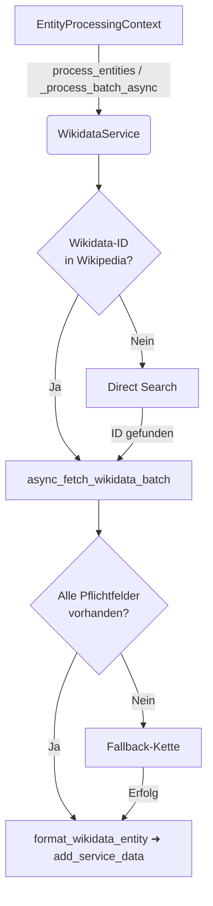

# WikidataService – Funktionsweise & Fallback-Strategien

*Stand: 2025-06-15*

Dieses Dokument beschreibt den **WikidataService** des Projekts *entityextractorbatch*. Es erläutert den internen Ablauf, die Datenstrukturen sowie alle Fallback-Mechanismen, damit Entwickler:innen den Service leichter warten oder erweitern können.

---
## 1. Modulübersicht

| Datei | Zweck |
|-------|-------|
| `service.py` | Hauptklasse `WikidataService` (Batch-Verarbeitung, Fallback-Koordination, Statistik). |
| `async_fetchers.py` | Asynchrone Low-Level-Requests: Entity-Fetch, Search, Label-Lookup. |
| `formatters.py` | Hilfsfunktionen, um rohe API-Antworten in das Standard-Schema zu überführen. |
| `fallbacks.py` | Implementiert direkte Suche, Sprach-Translation, Synonym-Strategie etc. |
| `batch_service.py` | Historische Utilities; aktuell nur ergänzend. |
| `__init__.py` | Komfortexporte. |

Alle Module sind **async**-fähig und nutzen die `aiohttp`-Session des Projekt-Orchestrators.

---
## 2. Verarbeitungs-Pipeline



1. **Primärer Weg**: Die ID wird direkt aus der bereits gespeicherten Wikipedia-Quelle extrahiert (`extract_wikidata_id_from_wikipedia`).  
2. **Sekundär**: Falls keine ID vorliegt, wird per `async_search_wikidata` nach dem Lemma gesucht (*Direct Search*).  
3. **Formatter**: Jede rohe Antwort wird über `format_wikidata_entity` in das Standard-Dict umgewandelt und via `has_required_fields` validiert.  
4. **Tertiäre Fallback-Kette** (nur wenn Daten unvollständig):
   1. **Language Fallback** (`apply_language_fallback`) – übersetzt den Begriff (Standard: Deutsch → Englisch) und sucht erneut.
   2. **Synonym Fallback** (`apply_synonym_fallback`) – erzeugt Synonyme (ggf. OpenAI-gestützt) und sucht pro Synonym.

Die Reihenfolge wird in `service.py::_process_batch_async` gesteuert.

---
## 3. Datenstruktur (`sources["wikidata"]`)

```jsonc
"sources": {
  "wikidata": {
    "id": "Q190828",
    "uri": "https://www.wikidata.org/entity/Q190828",
    "label": "Zugspitze",
    "description": "highest mountain in Germany",
    "aliases": ["Mount Zugspitze"],
    "types": ["Q8502", "Q5398426"],
    "part_of": ["Q1471555"],
    "has_parts": ["Q200123"],
    "coordinates": {"lat": 47.421, "lon": 10.985},
    "sameAs": ["http://dbpedia.org/resource/Zugspitze"],
    "fallback_source": "direct_search",   // optional
    "fallback_attempts": 1                  // optional
  }
}
```
Pflichtfelder (vgl. `has_required_fields`): `id`, `label` **und** `description` (Englisch bevorzugt).

---
## 4. Fallback-Strategien

| # | Funktion | Beschreibung | Zählung in `fallback_usage` |
|---|----------|--------------|-----------------------------|
| 1 | **Direct Search** (`apply_direct_search`) | Fragt die Wikidata Search-API (`action=wbsearchentities`) nach dem Lemma. | `direct_search` |
| 2 | **Language Fallback** (`apply_language_fallback`) | Übersetzt den Begriff (z. B. per OpenAI) und wiederholt die Suche. | `language` |
| 3 | **Synonym Fallback** (`apply_synonym_fallback`) | Generiert Synonyme / Varianten und versucht Suche erneut. | `synonym` |

Jede Strategie annotiert bei Erfolg `fallback_source` und inkrementiert `fallback_attempts`.

---
## 5. Konfigurationsoptionen (Auszug)

| Schlüssel | Zweck | Default |
|-----------|-------|---------|
| `WIKIDATA_USE_FALLBACKS` | Fallback-Kette komplett deaktivieren? | `True` |
| `WIKIDATA_ENABLE_TRANSLATION_FALLBACK` | Sprache-Fallback aktivieren? | `True` |
| `WIKIDATA_ENABLE_SYNONYM_FALLBACK` | Synonym-Fallback aktivieren? | `True` |
| `WIKIDATA_MAX_SYNONYM_FALLBACK_ATTEMPTS` | Max. Synonym-Versuche | `3` |
| `WIKIDATA_BATCH_SIZE` | Batch-Größe für Entity-Fetch | `20` |
| `USER_AGENT` | Header für HTTP-Aufrufe | `EntityExtractor/1.0` |

---
## 6. Logging & Statistik

* **`logging`** (Stdlib) wird genutzt; Level via Projekt-Settings.  
* Statistikfelder via `get_statistics()`:
  ```jsonc
  {
    "successful_entities": 23,
    "partial_entities": 4,
    "failed_entities": 3,
    "api_calls": {"search": 10, "entity": 23, "labels": 5},
    "fallback_usage": {"direct_search": 3, "language": 2, "synonym": 1}
  }
  ```

---
## 7. Erweiterung & Best-Practices

1. **Neuen Datentyp abfragen**: In `async_fetchers.py` Anpassung der SPARQL-Query oder REST-Parameter, anschließend `formatters.py` erweitern.  
2. **Weiteren Fallback hinzufügen**: Neue async-Funktion in `fallbacks.py` implementieren und in `_process_batch_async` einbinden.  
3. **Performance**: Batch-Größe und gleichzeitige Tasks können über Settings skaliert werden; Session-Reuse ist bereits implementiert.  
4. **Tests**: Unit-Tests mit Mock-Antworten für jeden Fallback; Integrationstest gegen Live-API.

---
## 8. Quickstart-Snippet

```python
from entityextractor.services.wikidata.service import WikidataService
from entityextractor.core.context import EntityProcessingContext

service = WikidataService()
ctx = EntityProcessingContext(entity_name="Zugspitze")

import asyncio
asyncio.run(service.process_entity(ctx))

print(ctx.output_data["sources"]["wikidata"])  # → formatiertes Dict
```

---
**Maintainer-Kontakt**: winds…@example.com
