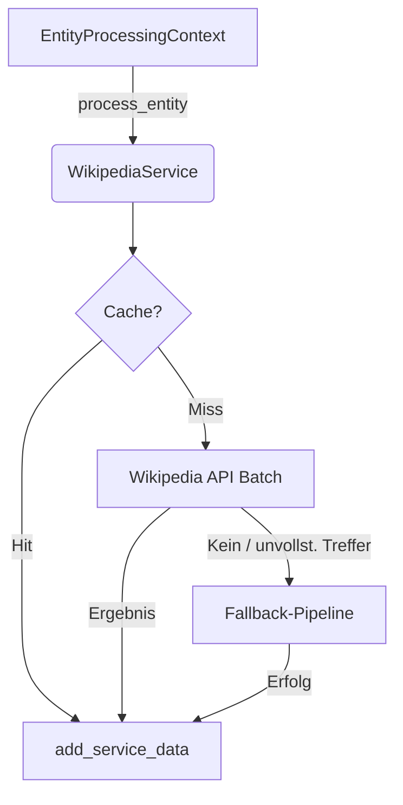

# WikipediaService – Funktionsweise & Fallback-Strategien

*Stand: 2025-06-15*

Dieser Leitfaden erklärt, wie der **WikipediaService** des Projekts *entityextractorbatch* arbeitet und welche Rückfall- (Fallback-) Mechanismen eingesetzt werden, um Wikipedia-Daten zuverlässig auszulesen. Er richtet sich an Entwickler:innen, die den Service warten, erweitern oder in eine andere Anwendung integrieren möchten.

---
## 1. Modulübersicht

| Datei | Zweck |
|-------|-------|
| `service.py` | Zentrale Klasse `WikipediaService` mit Hauptlogik: Initialisierung, Entity-Verarbeitung, Batch-Modus, Statistik. |
| `async_fetchers.py` | Asynchrone Low-Level-Funktionen für Wikipedia-API-Requests in Batch-Form. |
| `fallbacks.py` | Fallback-Strategien (Sprache, OpenSearch, Synonyme, BeautifulSoup) als eigenständige async-Funktionen. |
| `batch_service.py` | Historische/zusätzliche Batch-Hilfsfunktionen (derzeit kaum benutzt). |
| `__init__.py` | Exporte & Komfortfunktionen. |

Alle Untermodule verwenden **async/await**, verzichten auf blockierende Aufrufe und nutzen eine gemeinsame `aiohttp`-Session, die vom Service verwaltet wird (`create_session` / `close_session`).

---
## 2. Datenfluss



1. **Aufruf**: `WikipediaService.process_entity(context)` wird von der Pipeline für jede Entität aufgerufen.  
2. **Cache-Lookup**: In `self.cache_dir` gespeicherte JSON-Responses werden zuerst geprüft.  
3. **Batch-API**: Fehlende Entitäten werden per `async_fetch_wikipedia_data` gesammelt an die offizielle MediaWiki-API geschickt (`/w/api.php?action=query&prop=extracts|pageimages|...`).  
4. **Validierung & Formatierung**: Das rohe Resultat wird in `_format_wikipedia_result` in das Standard-Schema überführt und anschließend über `validate_wikipedia_data` geprüft.  
5. **Fallbacks** *(optional)*: Wenn kein oder nur ein unzureichender `extract` (<100 Zeichen) vorliegt, greift `apply_all_fallbacks` (siehe Abschnitt 4).  
6. **Speichern**: Das fertige Dict wird im `EntityProcessingContext` unter `sources["wikipedia"]` gespeichert und erneut im Cache abgelegt.

---
## 3. Datenstruktur

```jsonc
"sources": {
  "wikipedia": {
    "title": "Zugspitze",
    "url": "https://de.wikipedia.org/wiki/Zugspitze",
    "language": "de",
    "extract": "Die Zugspitze ist mit 2962 m ü. NHN …",
    "categories": ["Berg", "Bayern", …],
    "internal_links": ["Garmisch-Partenkirchen", "Wettersteingebirge", …],
    "thumbnail": "https://upload.wikimedia.org/…/Zugspitze.jpg",
    "wikidata_id": "Q190828",
    "fallback_source": "en_wikipedia",    // nur wenn Fallback
    "fallback_attempts": 1                //  ^
  }
}
```
* **Flache Struktur**: Kein doppeltes `wikipedia.wikipedia` mehr.  
* **Optionale Felder**: `categories`, `internal_links`, `thumbnail` und `wikidata_id` werden nur gesetzt, wenn verfügbar.

---
## 4. Fallback-Strategien (`fallbacks.py`)

Die Fallbacks werden **in dieser Reihenfolge** angewendet, solange kein verwertbarer `extract` vorhanden ist:

| # | Funktion | Idee | Erfolgsbedingung |
|---|----------|------|------------------|
| 1 | `apply_language_fallback` | Versucht dasselbe Lemma in einer alternativen Wikipedia-Sprache (Standard: *en* ↔ *de*). | `extract` vorhanden. |
| 2 | `apply_opensearch_fallback` | Fragt die MediaWiki-OpenSearch-API nach ähnlichen Titeln und versucht erneut API-Fetch. | s.o. |
| 3 | `apply_synonym_fallback` | Erstellt Synonyme (z. B. durch Lemma-Varianten, Akronyme) und ruft API per Synonym ab. | s.o. |
| 4 | `apply_beautifulsoup_fallback` | Holt direkt die HTML-Seite und extrahiert per BeautifulSoup den Fließtext, wenn alles andere scheitert. | `extract` vorhanden. |

`apply_all_fallbacks` führt diese Kette aus und zählt **`fallback_attempts`** mit. Jede erfolgreiche Strategie annotiert `fallback_source`, z. B. `en_wikipedia` oder `opensearch_title`.

Die maximale Anzahl an Fallback-Versuchen wird über `WIKIPEDIA_MAX_FALLBACK_ATTEMPTS` gesteuert (Default = 3).

---
## 5. Konfigurierbare Optionen (`settings.py`)

| Schlüssel | Bedeutung | Default |
|-----------|-----------|---------|
| `LANGUAGE` | Ausgangssprache (`de`, `en`, …) | `en` |
| `WIKIPEDIA_BATCH_SIZE` | Größe der Sammelabfrage | 20 |
| `WIKIPEDIA_USE_FALLBACKS` | Fallbacks komplett deaktivieren? | `True` |
| `WIKIPEDIA_ALWAYS_RUN_FALLBACKS` | Fallbacks auch bei kurzem Extract erzwingen | `False` |
| `WIKIPEDIA_MAX_FALLBACK_ATTEMPTS` | Obergrenze für Kette | 3 |
| `CACHE_DIR` | Basisverzeichnis für Caches | `entityextractor_cache` |
| `DEBUG_WIKIPEDIA` | Zusätzliche DEBUG-Logs | `False` |

---
## 6. Logging & Statistik

* **loguru** wird genutzt, Level wird über `get_service_logger` gesetzt.  
* Wichtige Ereignisse: Cache-Hits, API-Antworten, Fallback-Erfolge und ‑Fehler.  
* Methoden `WikipediaService.get_statistics()` bzw. Kontext-Statistiken liefern u. a.:
  * Anzahl erfolgreicher/teilweiser/fehlgeschlagener Entitäten
  * Summe der Fallback-Erfolge

---
## 7. Erweiterung & Best-Practices

1. **Neue Fallback-Methode hinzufügen**
   1. Implementieren Sie eine async-Funktion in `fallbacks.py`.  
   2. Hängen Sie den Aufruf an geeigneter Stelle in `apply_all_fallbacks` an.  
   3. Dokumentieren Sie `fallback_source`-Label.
2. **Weitere Felder erfassen**
   * Passen Sie `_format_wikipedia_result` an und ergänzen Sie das JSON-Schema (`schemas/service_schemas.py`).
3. **Batch-Performance**
   * Erhöhen Sie `WIKIPEDIA_BATCH_SIZE`, wenn die API-Limits es erlauben.  
   * Verwenden Sie gemeinsame `aiohttp`-Session für komplette Pipeline (bereits implementiert).
4. **Testing**
   * Unit-Tests sollten Mock-Responses pro Fallback enthalten.  
   * Integration-Tests können gegen die echte API mit `mode=live` laufen.

---
## 8. Schnellstart-Snippet

```python
from entityextractor.services.wikipedia.service import WikipediaService
from entityextractor.core.context import EntityProcessingContext

service = WikipediaService()
ctx = EntityProcessingContext(entity_name="Zugspitze")

import asyncio
asyncio.run(service.process_entity(ctx))

print(ctx.output_data["sources"]["wikipedia"])  # → formatiertes Dict
```

---
**Kontakt & Maintainer**: winds…@example.com
